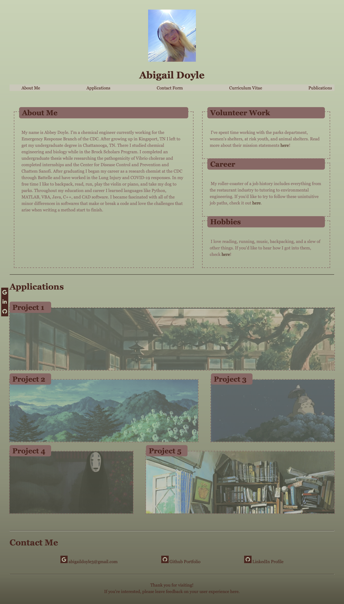

# module-two-challenge
Personal Portfolio

## Description

This project was meant to create an online portfolio that will eventually showcase web applications I develop throughout both this bootcamp and my professional career. As a future web developer, it will be important to have a central location containing some of my work for employers and fellow developers. It will also be key to seeing how far my skills develop as I gain more experience. 

The portfolio, as it currently stands, was developed using only HTML and CSS. This was the first webpage I've created from scratch without the use of any third party developers. Doing this, I learned important skills such as debugging code and the delicate relationships between HTML and CSS.


<!-- Provide a short description explaining the what, why, and how of your project. Use the following questions as a guide:

- What was your motivation?
- Why did you build this project? (Note: the answer is not "Because it was a homework assignment.")
- What problem does it solve?
- What did you learn? -->

## Table of Contents (Optional)

<!-- If your README is long, add a table of contents to make it easy for users to find what they need. -->

- [Installation](#installation)
- [Usage](#usage)
- [Credits](#credits)
- [License](#license)
- [Badges](#badges)
- [Features](#features)
- [Tests](#tests)

## Installation

There is no installation required for this online portfolio. Simply follow this [link](https://abbeydoyle.github.io/module-two-challenge/), open in your preferred browser, and peruse the basis for my future web developer portfolio.

<!-- What are the steps required to install your project? Provide a step-by-step description of how to get the development environment running. -->


## Usage

There are 6 main sections of this repository:

- [Assets Folder](https://github.com/abbeydoyle/module-two-challenge/tree/main/assets) - Contains all [webpage images](https://github.com/abbeydoyle/module-two-challenge/tree/main/assets/images) and the CSS Folder

- [CSS Folder](https://github.com/abbeydoyle/module-two-challenge/tree/main/assets/css) - Contains all CSS Styling for the entire webpage along with a CSS graveyard file, where outdated CSS is stored for future reference

- [HTML](https://github.com/abbeydoyle/module-two-challenge/blob/main/index.html) - Contains the HTML encoding the Portfolio Homepage

- [Subpages Folder](https://github.com/abbeydoyle/module-two-challenge/tree/main/subpages) - Contains all child html pages for the html Portfolio home parent page along with an HTML graveyard file, used for unused code for future reference

- [License](https://github.com/abbeydoyle/module-two-challenge/blob/main/LICENSE) - Contains the webpage license

- [ReadMe](https://github.com/abbeydoyle/module-two-challenge/blob/main/README.md) - This file containing an executive overview of the project


 

 Screenshots of all subpages can be found in the [images](https://github.com/abbeydoyle/module-two-challenge/tree/main/assets/images) folder.


<!-- Provide instructions and examples for use. Include screenshots as needed.

To add a screenshot, create an `assets/images` folder in your repository and upload your screenshot to it. Then, using the relative filepath, add it to your README using the following syntax:

    ```md
    
    ``` -->

## Credits

This webpage was built using UW Trilogy Bootcamp class materials as references.

I received advice on this challenge from my tutor, Rene Trevino.

## License

MIT License

Copyright (c) 2022 abbeydoyle

Permission is hereby granted, free of charge, to any person obtaining a copy of this software and associated documentation files (the "Software"), to deal in the Software without restriction, including without limitation the rights to use, copy, modify, merge, publish, distribute, sublicense, and/or sell copies of the Software, and to permit persons to whom the Software is furnished to do so, subject to the following conditions:

The above copyright notice and this permission notice shall be included in all copies or substantial portions of the Software.

THE SOFTWARE IS PROVIDED "AS IS", WITHOUT WARRANTY OF ANY KIND, EXPRESS OR IMPLIED, INCLUDING BUT NOT LIMITED TO THE WARRANTIES OF MERCHANTABILITY, FITNESS FOR A PARTICULAR PURPOSE AND NONINFRINGEMENT. IN NO EVENT SHALL THE AUTHORS OR COPYRIGHT HOLDERS BE LIABLE FOR ANY CLAIM, DAMAGES OR OTHER LIABILITY, WHETHER IN AN ACTION OF CONTRACT, TORT OR OTHERWISE, ARISING FROM, OUT OF OR IN CONNECTION WITH THE SOFTWARE OR THE USE OR OTHER DEALINGS IN THE SOFTWARE.

<!-- The last section of a high-quality README file is the license. This lets other developers know what they can and cannot do with your project. If you need help choosing a license, refer to [https://choosealicense.com/](https://choosealicense.com/). -->

---

<!-- 🏆 The previous sections are the bare minimum, and your project will ultimately determine the content of this document. You might also want to consider adding the following sections. -->

## Badges


<!-- 

Badges aren't necessary, per se, but they demonstrate street cred. Badges let other developers know that you know what you're doing. Check out the badges hosted by [shields.io](https://shields.io/). You may not understand what they all represent now, but you will in time. -->

## Features

This page features:

- Fixed social media bar
- Contact links
- Media screen compatibility
- Nav bar with linked sections
- Glowing sections
- Basis for a feedback form
- Self-designed Favicon image


<!-- If your project has a lot of features, list them here. -->

<!-- ## How to Contribute

If you created an application or package and would like other developers to contribute it, you can include guidelines for how to do so. The [Contributor Covenant](https://www.contributor-covenant.org/) is an industry standard, but you can always write your own if you'd prefer. -->

## Tests

This webpage is compatible on various screen sizes! Test it out by visiting the page on your computer, tablet, or phone.

Click the inline banner categories to be immediately directed to the corresponding webpage sections.

Test out the fixed social media bar by clicking the icons to be redirected to the corresponding pages.

There are several other embedded links on this site, check them out!

When on a subpage, be immediately redirected back to the homepage by clicking the fixed home icon on the left hand side.

Feel free to test out the radio buttons and check boxes on the Feedback Form but please note that this form cannot currently be submitted.

<!-- Go the extra mile and write tests for your application. Then provide examples on how to run them here. -->